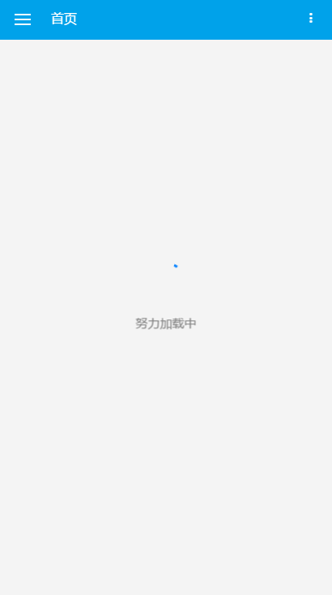

## Vue.js 知乎日报
vue-zhihuDaily 是用vue.js 开发的知乎日报，采用了vue-cli 和 webpack进行打包。

作为学习 vue.js 的入门示例，帮助快速上手数序使用 vue 开发一个相对完整项目的流程。代码结构或许不算很规范，但也能对vue开发项目遇到的问题有一个很好的体会。


## 图示



## API
api来源于 <a href="https://github.com/izzyleung/ZhihuDailyPurify/wiki/%E7%9F%A5%E4%B9%8E%E6%97%A5%E6%8A%A5-API-%E5%88%86%E6%9E%90" target="_blank">izzyleung</a>。

图片会提示图片只允许在知乎使用，若直接使用api返回的图片地址，知乎会直接返回403，这里直接使用了<a href="https://github.com/GaryChangCN/zhihu-daily-byVuejs" target="_blank">GaryChangCN</a>提供的 node 来代理更改referer头获取图片。


## 功能
* 查看最新消息
* 查看以往消息
* 主题类别
* 主题列表
* 查看主题以往列表
* 主题详情内容
  * 分享
  * 收藏 - 模拟
  * 点赞 - 模拟
  * 评论
    * 评论列表
    * 发表评论 - 模拟
* 主编
  * 主编列表
  * 主编详情
* 我的收藏 - 无收藏
* 登录 - 模拟请求
* 个人中心


## 库与组件
该项目使用vue-cli构建、打包，配合vue全家桶（vue、vuex、vue-router）进行编码、开发
* 网络请求使用 axios
* 日期时间格式化使用 moment
* 二维码生成 v-qrcode
* 图片轮换 vue-awesome-swiper
* 下拉无限加载 vue-infinite-scroll
* 图片懒加载 vue-lazyload


## 其他
* 侧边栏展开关闭使用 vuex
* 是否登录 与 登录请求的状态使用 vuex
* 由于 API 请求使用代理，不提供在线预览地址，请下载安装


## 使用
``` bash
# 安装依赖包
npm install

# 启动项目开发
npm run dev

# 发布项目
npm run build
```